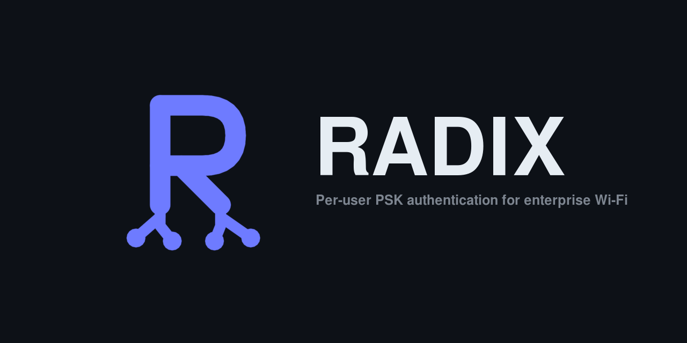
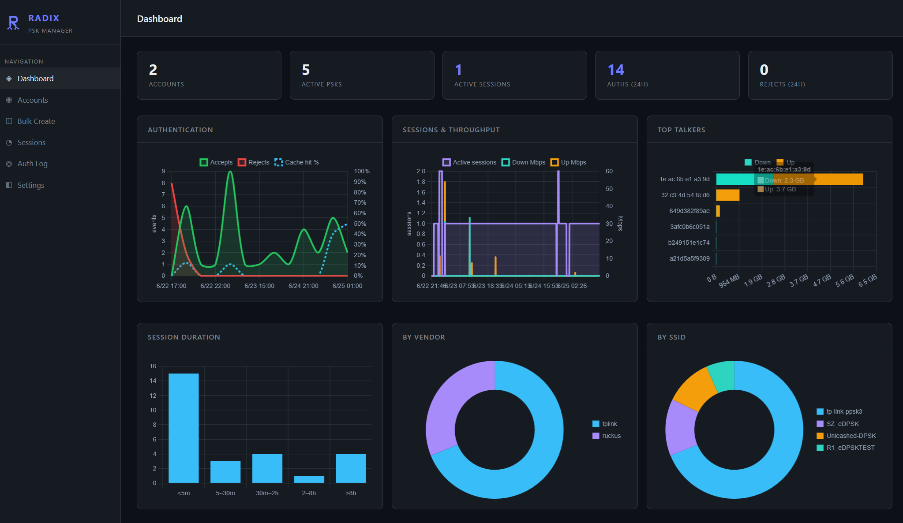
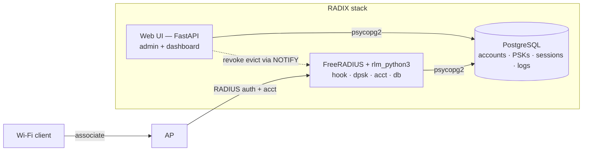

<p align="center">
  
</p>

RADIX is a **FreeRADIUS per-user PSK authentication backend** — a lightweight AAA
layer for home labs and small networks running WPA2-PSK Wi-Fi. Each user (or
device) gets their own pre-shared key on a single shared SSID; RADIX verifies the
4-way-handshake material the AP forwards over RADIUS and hands back the matching key
material, plus an optional per-key VLAN. It runs comfortably on a Raspberry Pi.

Per-user PSK goes by a different name on each platform — TP-Link Omada **PPSK**,
Ruckus **DPSK**, Cisco/Meraki **iPSK**, Aruba **MPSK** — and RADIX speaks the
relevant one per vendor.

It runs in-process inside FreeRADIUS via `rlm_python3` (no extra network hop) and
ships with a small web UI for managing accounts, keys, and viewing auth logs.

<p align="center">
  
  <br>
  <em>Built-in dashboard: auth rate &amp; cache hits, live sessions and throughput, top talkers, and per-vendor/SSID breakdowns.</em>
</p>



## Scope

RADIX is a self-hosted lab/hobbyist tool for per-user PSK authentication. It
deliberately stops at the standard RADIUS layer — it verifies the handshake,
hands back key material, and optionally assigns a VLAN. It has **no** captive-portal
onboarding, tenant/occupancy management, billing, cloud orchestration, or commercial
support. If you need a supported, production-grade enterprise solution with those
capabilities, evaluate the commercial products in this space.

## How it works

When a client associates, the AP performs the WPA2-PSK 4-way handshake and relays
the handshake material to RADIUS. RADIX must find *which* PSK the client used
(it never sees the PSK directly) by verifying the message integrity code (MIC):

1. **Detect the vendor** from which attributes are present in the request.
2. **Extract** SSID, AP MAC, client MAC, ANonce, SNonce, and the received MIC.
3. **Find the key** via a three-tier lookup (cheap → expensive):
   - **Tier 1 — cache:** an in-memory `(mac, ssid) → PMK` cache (TTL-bounded).
   - **Tier 2 — bound MAC:** the MAC was seen before and is bound to a PMK in the DB.
   - **Tier 3 — scan:** a new MAC; try every PMK for that SSID until the MIC matches,
     then bind the MAC for next time. This path is **rate-limited** (see below).
4. **Verify the MIC** by deriving the PTK from the candidate PMK and recomputing
   the MIC over the EAPOL frame with its MIC field zeroed.
5. **Reply** with the vendor-appropriate key material + optional VLAN, or reject.

The PMK is pre-computed (`PBKDF2-HMAC-SHA1(psk, ssid, 4096, 32)`) by the web UI when
a key is created and stored base64-encoded, so the auth path never runs PBKDF2.

## Repository layout

| Path | Role |
|------|------|
| `hook.py` | FreeRADIUS `rlm_python3` entry points (`authorize`, `post_auth`, `accounting`); starts the revocation listener |
| `dpsk.py` | Vendor detection, EAPOL parsing, MIC verification, PTK derivation, cache, Tier-3 rate limiter |
| `acct.py` | RADIUS accounting: parses Start/Interim/Stop and upserts session rows |
| `db.py` | Auth-path DB access (pooled), `LISTEN` revocation channel, accounting upsert |
| `migrations/` | Ordered, idempotent SQL migrations |
| `raddb/` | FreeRADIUS config overlays (`clients.conf`, site, `python3` module, vendor dictionary) |
| `web/` | FastAPI admin UI (`main.py`, `db.py`, templates, static) |
| `Dockerfile` / `web/Dockerfile` | Container images for the RADIUS and web services |
| `docker-compose.yml` | The full stack: `radius`, `web`, `postgres` |
| `tests/` | `pytest` unit tests for the crypto / parsing / rate-limit logic |
| `mcp/` | Standalone MCP server (stdio) exposing RADIX management as AI-assistant tools via the JSON API (see `mcp/README.md`) |

## Quick start

Requires Docker with the Compose plugin.

```bash
cp .env.example .env
# edit .env — at minimum set DB_PASSWORD, RADIUS_SECRET, and ADMIN_PASSWORD

docker compose up --build -d
```

- Web UI: <http://localhost:8050> (HTTP Basic auth — `ADMIN_USER` / `ADMIN_PASSWORD`).
  Change the published port with `WEB_PORT` in `.env` (e.g. `WEB_PORT=80`).
- RADIUS auth: UDP `1812`, accounting: UDP `1813`

Point your AP/controller's external RADIUS server at the host on port 1812 using the
shared secret from `RADIUS_SECRET`. Then in the web UI: create an account, assign it a
PSK on your SSID, and connect a device using that PSK.

To pick up code changes later, rebuild in place: `docker compose up --build -d`.

## Configuration

All configuration is via environment variables (see `.env.example`).

| Variable | Default | Used by | Purpose |
|----------|---------|---------|---------|
| `DB_HOST` `DB_NAME` `DB_USER` `DB_PASSWORD` | — | both | PostgreSQL connection |
| `DB_POOL_MAX` | `16` | radius | Max pooled DB connections |
| `RADIUS_SECRET` | — | both | RADIUS shared secret (web UI displays it on the Settings page) |
| `PMK_CACHE_TTL` | `86400` | radius | Tier-1 cache lifetime, seconds |
| `RADIX_DEBUG` | off | radius | When truthy, logs full request + reply attributes (info level) |
| `RUCKUS_DPSK_REPLY` | `mppe` | radius | Ruckus PMK reply form: `mppe` (Unleashed/ZD) or `vsa` (SmartZone) |
| `RADIUS_HOST` `RADIUS_PORT` | `—` / `1812` | web | Shown on the Settings page so you can configure APs |
| `WEB_PORT` | `8050` | web | Host port the web UI is published on (container listens on `8000` internally) |
| `ADMIN_USER` | `admin` | web | Admin UI username |
| `ADMIN_PASSWORD` | — | web | Admin UI password. **If unset, the UI refuses to serve.** |
| `RETENTION_DAYS` | `90` | web | Daily purge of `auth_log` / `acct_sessions` / `metrics_rollup` older than this; `0` disables |
| `RETENTION_INTERVAL_HOURS` | `24` | web | How often the retention sweep runs |
| `ANALYTICS_INTERVAL_SECONDS` | `300` | web | How often dashboard analytics are sampled + recomputed |
| `ANALYTICS_WINDOW_DAYS` | `7` | web | Time window the dashboard charts cover |
| `SESSION_STALE_MINUTES` | `30` | web | A session counts as active only if updated within this window; needs interim accounting on the AP (set ≥ 2× the interim interval). `0` disables the check (active = any open session) |
| `RADIX_TIER3_RATE` | `50` | radius | Global Tier-3 scans/sec (token-bucket refill) |
| `RADIX_TIER3_BURST` | `100` | radius | Token-bucket capacity |
| `RADIX_TIER3_MAX_FAILURES` | `10` | radius | Per-MAC failures before cooldown |
| `RADIX_TIER3_FAIL_WINDOW` | `60` | radius | Window the failure count accumulates over, seconds |
| `RADIX_TIER3_COOLDOWN` | `120` | radius | How long a MAC is blocked after tripping, seconds |
| `RADIX_TIER3_MAX_TRACKED` | `10000` | radius | Cap on tracked MACs (memory bound) |

## Vendor support

Vendor is detected by which attribute is present in the Access-Request.

| Vendor | Detect via | SSID | AP MAC | EAPOL frame | ANonce | SNonce offset | Status |
|--------|-----------|------|--------|-------------|--------|---------------|--------|
| TP-Link Omada | `TPLink-Authentication-FindKey` | sub-TLV 3 | sub-TLV 6 (radio BSSID), fallback 4 | sub-TLV 1 | sub-TLV 2 | 17 | **Working** |
| OpenWiFi | `FreeRADIUS-802.1X-Anonce` | `Called-Station-Id` after `:` | `Called-Station-Id` before `:` | `FreeRADIUS-802.1X-EAPoL-Key-Msg` | `FreeRADIUS-802.1X-Anonce` | 34 | Implemented |
| Ruckus eDPSK | `Ruckus-DPSK-EAPOL-Key-Frame` | `Ruckus-SSID` | `Ruckus-BSSID` | `Ruckus-DPSK-EAPOL-Key-Frame` | `Ruckus-DPSK-Anonce` | 17 | **Working** — Unleashed, Ruckus One, SmartZone (vSZ 7.2) |

### Reply attributes on success

| Vendor | Attribute | Value |
|--------|-----------|-------|
| OpenWiFi | `Tunnel-Password` | Raw PSK string |
| TP-Link | `TPLink-EAPOL-Found-PMK` | Raw 32-byte PMK (+ `Tunnel-Password` + VLAN attrs) |
| Ruckus — Unleashed / Ruckus One / SmartZone (default) | `MS-MPPE-Recv-Key` | 32-byte PMK |
| Ruckus `RUCKUS_DPSK_REPLY=vsa` (fallback, untested) | `Ruckus-DPSK` | `\x00` + 32-byte PMK |

VLAN assignment (all vendors) uses `Tunnel-Type=13`, `Tunnel-Medium-Type=IEEE-802`,
`Tunnel-Private-Group-Id=<vlan>`. Note: `Tunnel-Medium-Type` must be the enum name
`IEEE-802`; the integer `6` is silently dropped by FreeRADIUS.

### TP-Link Omada specifics

Omada sends **two** RADIUS requests per connection, and both must Accept:

1. **MAC auth** (no PPSK attrs; `NAS-Identifier` carries a `TP-Link` prefix).
   - Known device (MAC bound in DB): Accept with `Tunnel-Password` = PSK (+ VLAN attrs if the PSK has one).
   - Unknown device (first time): Accept with **no reply attributes** — no VLAN override, so the AP keeps the client on the SSID's own network; the PSK arrives via the PPSK blob.
2. **PPSK blob** (`TPLink-Authentication-FindKey` present): Accept with the PMK reply above.

If MAC auth is rejected, the AP can't bootstrap the 4-way handshake even when the
PPSK request would succeed.

### Ruckus eDPSK specifics

Configure the WLAN for **eDPSK (external DPSK)** with RADIX as the external RADIUS
server (auth `1812`, accounting `1813`). The AP forwards the 4-way-handshake EAPOL
frame; RADIX verifies the MIC and returns the PMK in `MS-MPPE-Recv-Key`. Verified on
**Unleashed, Ruckus One, and SmartZone (vSZ 7.2)** — all use the same reply
(`RUCKUS_DPSK_REPLY=vsa` is an untested fallback for any firmware that wants the
`Ruckus-DPSK` VSA instead).

- **Dynamic VLAN must be enabled** on the WLAN, or the AP ignores the RADIUS-assigned
  VLAN and keeps clients on the WLAN's native VLAN.
- A VLAN or key change only takes effect on a **full re-authentication**. A quick
  reconnect reuses the AP's cached PMKID and skips RADIUS entirely, so the client keeps
  its old VLAN/key until it fully re-auths (forget the SSID and rejoin, or otherwise
  drop the cached PMKSA).

## Managing keys (web UI)

- **Dashboard** — top-line counts, recent auth events, and analytics charts
  (see below).
- **Accounts** — create accounts; drill in to assign or revoke PSKs (with optional VLAN).
  A PSK's MAC bindings are learned automatically on first successful auth. PSKs are shown
  blurred (click to reveal) with a one-click copy button.
- **Bulk** — upload a CSV (`username`, `email`, `vlan`) for one SSID; downloads the
  generated PSKs as a CSV.
- **Settings** — RADIUS connection details to configure your APs.
- **Logs** — filterable auth log (by MAC / SSID / result).

### Analytics dashboard

The dashboard renders charts with [Chart.js](web/static/vendor/chart.umd.min.js)
(vendored — no CDN, works offline): authentication accepts/rejects + cache
hit-rate over time, sessions & throughput, top talkers by data, session-duration
histogram, and breakdowns by vendor and SSID.

It's built to stay light enough for a Raspberry Pi: the web container samples a
small `metrics_rollup` row and recomputes all aggregates on a timer
(`ANALYTICS_INTERVAL_SECONDS`), caching the result in memory. The browser fetches
that cached JSON from `/api/analytics`, so page loads never trigger table scans —
load cost is independent of how many people are viewing. Charts cover the last
`ANALYTICS_WINDOW_DAYS`.

### Data retention

`auth_log`, `acct_sessions`, and `metrics_rollup` grow continuously. A background
sweep in the web container deletes rows older than `RETENTION_DAYS` (default 90;
set `0` to disable). Active sessions are preserved regardless of age (their
`updated_at` advances on every interim update).

### Revocation

Revoking a PSK is a **soft delete**: the row is stamped `revoked_at` rather than
deleted, so its auth history and MAC bindings survive for audit. The auth path
filters out revoked keys. To make revocation take effect *immediately* (rather than
waiting for the Tier-1 cache to expire), the web process emits a PostgreSQL
`NOTIFY` on the `radix_revoke` channel; a listener thread in the RADIUS process
evicts the cached PMK. If the listener is unavailable, revocation still takes
effect within `PMK_CACHE_TTL`.

### RADIUS accounting

If the AP/controller is configured to send accounting to UDP `1813`, RADIX
records one row per session (`Acct-Session-Id`), upserted across Start /
Interim-Update / Stop: client MAC, username, SSID, framed IP, bytes in/out,
session duration, and terminate cause. Octet counters combine the 32-bit value
with its Gigawords high word, and use `GREATEST` so out-of-order interim packets
can't roll a counter backward.

- **Sessions** page — active and recent sessions, with a filter for active only.
- **Account detail** — that account's sessions (resolved via learned MAC
  bindings) plus total bytes up/down.
- **Dashboard** — an active-session count.

A session counts as **active** only while it's open *and* has sent an interim
update within `SESSION_STALE_MINUTES` — so sessions whose Stop was lost (device
out of range, controller reboot) age out of the active count instead of lingering
as ghosts (shown as `stale`). `Accounting-On`/`Accounting-Off` (NAS reboot) also
closes that controller's open sessions.

Accounting is observability only; authentication works without it. Enable it on
the AP side (e.g. Omada's RADIUS profile) and set a sane interim interval, since
interim updates add database writes.

### Tier-3 rate limiting

The Tier-3 scan is O(number of PSKs on the SSID), so spoofed MACs with junk MICs
could force repeated full scans. Two in-memory limiters guard it:

- **Per-MAC cooldown** — after `RADIX_TIER3_MAX_FAILURES` failures within
  `RADIX_TIER3_FAIL_WINDOW`, that MAC is short-circuited for `RADIX_TIER3_COOLDOWN`.
- **Global token bucket** — caps total scans/sec (`RADIX_TIER3_RATE` / `_BURST`),
  the backstop against MAC-rotation floods.

Throttled requests reject silently (no DB write) to avoid log amplification.

## API access

Beyond the web UI, RADIX exposes a JSON API for automation and the MCP server.

**Credentials.** Generate an API client under **Settings → API Clients** — you get
a key (`rdx_…`) and a secret shown **once** (only a SHA-256 of the secret is
stored). Revoke a client anytime from the same page.

**Auth.** Every route accepts admin HTTP Basic *or* an API client. For the API,
send the client credential as a bearer token (HTTP Basic with key as username /
secret as password also works):

```
Authorization: Bearer <key>:<secret>
```

An API client currently has full management access — treat the secret like a password.

**Endpoints** (JSON in/out, under `/api`):

| Method | Path | Purpose |
|--------|------|---------|
| GET | `/api/whoami` | verify credentials |
| GET | `/api/stats` | dashboard counts |
| GET | `/api/accounts` | list accounts |
| POST | `/api/accounts` | create account |
| GET | `/api/accounts/{id}` | account + its PSKs |
| PATCH | `/api/accounts/{id}` | rename / change email |
| DELETE | `/api/accounts/{id}` | delete (cascades) |
| POST | `/api/accounts/{id}/psks` | add PSK (auto-generates if `psk` omitted) |
| POST | `/api/psks/{id}/rekey` | re-key (auto-generates if `psk` omitted) |
| PATCH | `/api/psks/{id}/vlan` | set VLAN (`null` = untagged) |
| DELETE | `/api/psks/{id}` | revoke (soft-delete) |
| GET | `/api/sessions` | sessions (`?active=true`) |
| GET | `/api/logs` | auth log (`?mac=&ssid=&result=`) |
| GET | `/api/analytics` | dashboard analytics JSON |

```bash
curl -H "Authorization: Bearer rdx_xxx:secret" \
     -H "Content-Type: application/json" \
     -d '{"ssid":"CorpWiFi","vlan_id":20}' \
     http://host:8050/api/accounts/1/psks
```

**MCP server.** `mcp/` is a standalone [Model Context Protocol](https://modelcontextprotocol.io)
server (stdio) that wraps these endpoints as tools for AI assistants (Claude
Desktop/Code). It holds an API client credential and needs no database access.
See [`mcp/README.md`](mcp/README.md).

## Database & migrations

```sql
accounts(id, username, email, created_at)
pairwise_master_keys(id, account_id, psk, ssid, pmk_b64, vlan_id, revoked_at, created_at)
mac_bindings(id, pmk_id, mac, created_at)        -- learned on first auth
auth_log(id, mac, ssid, vendor, result, cache_hit, created_at)
acct_sessions(id, session_id, mac, username, ssid, nas_ip, framed_ip,
              in_octets, out_octets, session_time, status, terminate_cause,
              started_at, updated_at, stopped_at)
metrics_rollup(id, ts, active_sessions, total_in, total_out)   -- analytics samples
api_clients(id, name, client_key, secret_hash, created_at, last_used_at, revoked_at)
```

Migrations live in `migrations/`, named `NNN_*.sql`, and are **idempotent**
(safe to re-apply). On a fresh database, PostgreSQL runs them all in order via
`docker-entrypoint-initdb.d`. On an existing database they are **not** auto-applied —
pipe each new file through `psql` (e.g. `docker compose exec -T postgres psql -U radix
-d radix < migrations/NNN_name.sql`).
To add a schema change, drop in the next-numbered file — never edit an applied one.

## Security notes

- **Auth** — every route requires admin HTTP Basic (`ADMIN_USER`/`ADMIN_PASSWORD`)
  or a valid API client credential. Put it behind TLS / a reverse proxy for real use.
- **API clients have full access** — a client key/secret can do everything the admin
  can (read PSKs in cleartext, create/delete accounts). Only the secret's hash is
  stored; revoke compromised clients in Settings. Scope keys / add read-only keys
  is a possible future refinement.
- **PSKs are stored in cleartext** — unavoidable for per-user PSK (the AP needs the actual
  key to drive the handshake, and some vendors want the raw PSK back). Protect the
  database and restrict access to the host and the web UI accordingly.
- **`clients.conf`** ships as `0.0.0.0/0` (any source with the secret). Scope it to
  your AP subnets in production.
- `require_message_authenticator = true` is set (Blast-RADIUS mitigation).

## Testing

Unit tests cover the pure crypto, parsing, cache-eviction, and rate-limit logic
(no database or FreeRADIUS required — `tests/conftest.py` stubs both):

```bash
python3 -m pytest tests/ -q
```

The migration idempotency and the `NOTIFY`/`LISTEN` round-trip are validated
manually against a throwaway `postgres:16` container (see commit history).

## Operations / troubleshooting

- **Logs:** `docker compose logs -f radius` (FreeRADIUS + Python tracebacks),
  `docker compose logs -f web`.
- **Verbose RADIUS:** set `RADIX_DEBUG=1` to log full request + reply attributes, or run
  FreeRADIUS with `-X` for full debug.
- **A device won't connect:** check the auth log and confirm the SSID on the PSK
  matches exactly (the PMK is salted with the SSID), and that the VLAN exists.
- **Revoked device still connecting:** the Tier-1 cache or a missed `NOTIFY`;
  restart the `radius` container to flush the cache.

## Development note

The design, methodology, verification, code review, testing, and operational
procedures for this project are my own. A large portion of the code and the
product requirements were generated with the assistance of an AI/LLM, working
under my direction and reviewed and tested by me before inclusion.

## Building & licensing

RADIX ships as **source plus a `Dockerfile`** — there is no prebuilt image to pull.
Run `docker compose build` (or `docker compose up --build`) on the target, and the
`radius` image installs FreeRADIUS from the Ubuntu apt repositories at build time.

This is deliberate. FreeRADIUS is **GPLv2**, and RADIX loads into it in-process via
`rlm_python3`. By keeping it a build-time dependency that *you* fetch on *your* host,
no FreeRADIUS binaries are ever redistributed and no combined work is ever conveyed —
the GPLv2 obligations stay where they belong (with Ubuntu/Canonical, who already
provide the corresponding source). Distributing a prebuilt image would pull those
obligations onto the distributor, so the project doesn't.

Deploying on an appliance follows the same rule: build the image on a host matching the
appliance's architecture and run it there. Note the stack is three services
(`radius` + `web` + `postgres`) orchestrated with Compose, so the natural target is a
small Linux box running Docker (Raspberry Pi, mini-PC) rather than a router's built-in
single-container runtime.

## License

[MIT](LICENSE) © 2026 Alek M — RADIX's own code. FreeRADIUS (GPLv2) and the other
packages pulled in at build time remain under their respective upstream licenses.
